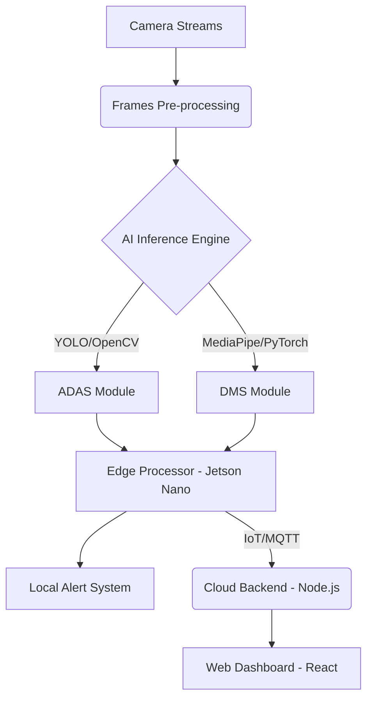

<div id="top" align="center">


[;Real-time+Driver+Monitoring+(DMS);Powered+by+PyTorch+%26+Computer+Vision;Smart+Telematics+%26+Edge+AI)](https://git.io/typing-svg)

<p align="center">
  
  
  
  
  
  <br>
  
  
</p>
</div>

---

## 🌟 Overview
**Smart Road Safety & Driving Intelligence System** is an AI-powered, Edge-deployable solution designed to significantly reduce road accidents. By combining an **Advanced Driver Assistance System (ADAS)** and a **Driver Monitoring System (DMS)**, it actively analyzes both the inward vehicle cabin environment and the outward road conditions in real-time.

<div align="center">
  <!-- Interactive Autonomous Driving Dashboard GIF -->
  
</div>

---

## 🚀 Key Features

### 🛣️ Advanced Driver Assistance Systems (ADAS) & Sensor Fusion
- **Multi-Modal Sensor Integration:** Real-time telemetry monitoring for Lidar, Long-Range Radar, Camera Systems, and Ultrasound.
- **Collision & Lane Warning Systems:** Evaluates trajectories to warn against imminent forward collisions and lane drifting.

### 👁️ Intelligent Driver Monitoring System (DMS)
- **Driver Attention Detection:** Calculates real-time focus ratios ($A = t_{focus} / t_{total}$) using advanced gaze tracking and facial landmark extraction CNNs.
- **Physiological Stress Monitoring:** Implements Heart Rate Variability (HRV) calculations via simulated ECG feeds to detect latent driver fatigue and drowsiness before they manifest visually.

### 🔮 Unsupervised Behavioral Clustering (K-Means)
- **Latent State Anomaly Detection:** Moves beyond standard supervised classification by utilizing an unsupervised K-Means clustering algorithm to identify hidden, novel driver behavior patterns (e.g., Micro-Sleep Risk, Distraction Anomalies) without requiring pre-labeled data.
- **Dynamic Risk Assessment:** Plots current driver telemetry against learned cluster centroids to continuously evaluate and score real-time driving risk.

### 📊 Interactive Streamlit Telemetry Dashboard
- **Live Inference Engine:** Processes dashcam frames through a custom PyTorch 3-Block CNN architecture to identify distinct driver states (based on the State Farm dataset).
- **Neural X-Ray:** Visualizes deep learning feature maps to explain how the model abstracts spatial variables and edges.

---

## 🧠 System Architecture



---

## 🛠️ Tech Stack & Hardware

### ⚙️ Hardware Recommendations
- **Inference Edge Engine:** NVIDIA Jetson Nano / Orin Nano, Raspberry Pi with Edge TPU.
- **Sensors:** 1080p Dashcam (Front), IR In-cabin Camera (Driver), GPS Module, IMU.

### 💻 Software Architecture
*   **Deep Learning & Vision:** PyTorch, OpenCV, Ultralytics YOLO, MediaPipe, Dlib.
*   **Unsupervised Learning:** Scikit-Learn (K-Means Clustering).
*   **Dashboard & Visualization:** Streamlit, Matplotlib, Pandas, Numpy.
*   **Edge Optimization:** ONNX, TensorRT (for achieving 30+ FPS capability).

---

## 🚦 Roadmap

- [x] **Phase 1:** Core Deep Learning Pipeline creation (State Farm Dataset).
- [ ] **Phase 2:** Lane Detection, Distance Estimation & Sensor Fusion integration.
- [ ] **Phase 3:** Edge AI optimization on NVIDIA Jetson (ONNX/TensorRT).
- [ ] **Phase 4:** Cloud Dashboard & Telemetry portal development.
- [ ] **Phase 5:** In-vehicle Real-world Testing & Tuning.

<div align="center">
  
</div>

## 🏁 Getting Started

### Prerequisites
Make sure you have the following installed on your machine:
* Python 3.9+ 
* CUDA-enabled GPU (optional but highly recommended for training models)

### Installation
1. Clone the repository:
   ```bash
   git clone https://github.com/saptarshiroy-2004/AI-Powered-Smart-Road-Safety-Driving-Intelligence-System.git
   cd AI-Powered-Smart-Road-Safety-Driving-Intelligence-System
   ```
2. Create and activate a virtual environment:
   ```bash
   python3 -m venv venv
   source venv/bin/activate  # On Windows: venv\Scripts\activate
   ```
3. Install dependencies:
   ```bash
   pip install -r requirements.txt  # (To be added once environment is finalized)
   ```

### Running the System
```bash
streamlit run app.py          # To launch the Interactive Telemetry Dashboard
python src/engine/train.py    # To run the PyTorch training pipeline
```

---

<div align="center">
  <h3>Built with ❤️ by an ambitious AI Developer.</h3>
  <p>If you find this repository helpful, consider giving it a ⭐!</p>
  
  <a href="#top">
    
  </a>
</div>
